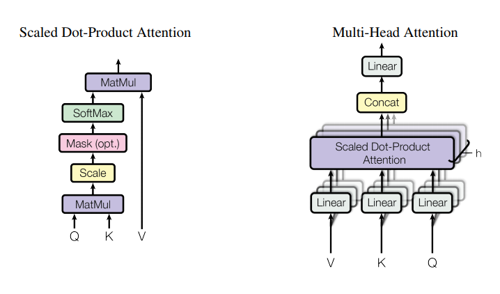

The transformer is still the state-of-the-art NLP architecture as of the beginning of 2021. This paper was published back in 2017. This article will take some notes on the paper.

Overall, the Transformer is a simple model compared to the dominant sequence transduction models based on recurrent or convolutional neural networks. The sequential nature of RNN prohibits parallelization. Although factorization tricks and conditional computation have significantly improved the computational performance, the fundamental constraint remains. The Transformer discards recurrence and solely relies on the attention mechanism, leading to high performance with low computation costs.

The sequential models usually share an auto-regressive fashion, the output sequence elements are generated one at a time. In this paradigm, the signals have to traverse a long distance when the sequences are long. In contrast, the Transformer has short travel paths for signals. This characteristic makes the model easier to learn the long-range dependencies. 

The left panel shows the attention scheme. An attention function can be described as **mapping a query and a set of key-value pairs to an output**.

$$ Attention(Q, K, V) = \text{softmax}(\dfrac{QK^T}{\sqrt{d_k}})V $$

The inner product of Q and K measures the relevance between the query and the key. The softmax function will pick out the strongest relevance. The output of the attention function is a weighted sum of V, but weights of more relevant dimension will stand out due to the softmax. 

Multihead attention (right panel in the chart) is just put a few identical attention devices, each capturing a unique aspect of the sequence (grammar, vocabulary, for example). 

The full picture of the architecture of the Transformer is more complicated. This piece of note only focused on the attention part, but I believe it is the core of the whole structure.

The Transformer allows for parallelization, model pre-training. These computing benefits are not that natural in most competing sequential models.

Raw paper link: https://arxiv.org/pdf/1706.03762
Reference: https://youtu.be/S27pHKBEp30
